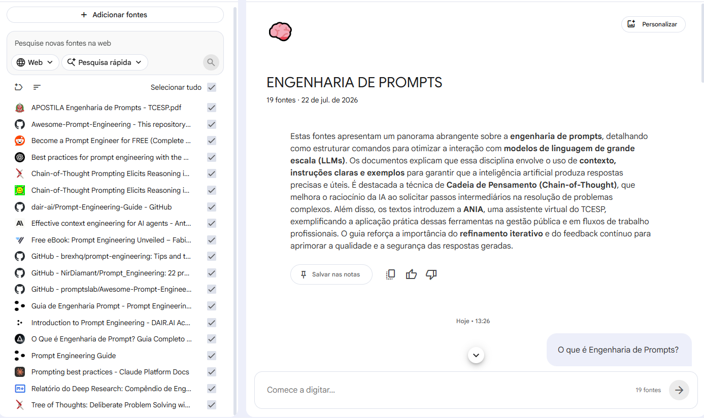

# 📚 Caderno Temático - Engenharia de Prompts com NotebookLM
> Projeto desenvolvido como parte do desafio da DIO utilizando o Google NotebookLM para estudar Engenharia de Prompts por meio de fontes confiáveis, organização do conhecimento e Inteligência Artificial Generativa.

---

# 📖 Sobre o Projeto
A Inteligência Artificial Generativa vem transformando a forma como estudamos, trabalhamos e resolvemos problemas. No entanto, a qualidade das respostas produzidas por esses modelos depende diretamente da forma como as instruções são fornecidas.
Pensando nisso, este projeto teve como objetivo utilizar o **Google NotebookLM** como ferramenta de aprendizagem ativa para estudar **Engenharia de Prompts**, reunindo materiais de referência, realizando consultas baseadas em documentos e produzindo um guia de estudos organizado.
Além da pesquisa sobre o tema, foram realizados testes com diferentes tipos de prompts para compreender como pequenas mudanças nas instruções podem influenciar a qualidade das respostas geradas pela IA.

---

# 🎯 Objetivos
Durante este projeto foram definidos os seguintes objetivos:
- Compreender o conceito de Engenharia de Prompts;
- Estudar as principais técnicas utilizadas na criação de prompts;
- Aprender boas práticas para comunicação com modelos de IA;
- Explorar os recursos do Google NotebookLM;
- Organizar informações provenientes de diferentes fontes;
- Produzir um material de revisão para estudos futuros.

---

# 🛠 Ferramentas Utilizadas
- Google NotebookLM
- GitHub
- Markdown
- Inteligência Artificial Generativa
- Navegador Web

---

# 📚 Fontes Utilizadas
Durante o estudo foram utilizadas diversas fontes confiáveis. Entre elas:

### 1. Adapta
**O que é Engenharia de Prompt**
https://adapta.org/blog/o-que-e-engenharia-de-prompt

---

### 2. DAIR.AI Academy
**Introduction to Prompt Engineering**
https://academy.dair.ai/courses/introduction-prompt-engineering

---

### 3. Tribunal de Contas do Estado de São Paulo (TCESP)
**Apostila Engenharia de Prompts**
https://www.tce.sp.gov.br/sites/default/files/2024-11/APOSTILA%20Engenharia%20de%20Prompts%20-%20TCESP.pdf

---
> Além das referências listadas acima, foram consultadas diversas documentações, artigos técnicos, guias especializados e materiais complementares, totalizando **19 fontes** adicionadas ao NotebookLM para apoiar o processo de estudo e a geração das respostas.
---

# 🖼️ Ambiente de Estudo no NotebookLM
Após selecionar e analisar as fontes, todas elas foram adicionadas ao Google NotebookLM para criar um ambiente centralizado de estudos. Ao todo, foram utilizadas **19 fontes**, entre artigos, guias, documentações oficiais e materiais técnicos sobre Engenharia de Prompts.

A imagem abaixo mostra parte das fontes carregadas no NotebookLM.

# 🤖 Utilização do NotebookLM

Após reunir as fontes de estudo, elas foram adicionadas ao NotebookLM para criar um ambiente centralizado de consulta.
Com base nesses materiais, a ferramenta foi utilizada para:

- responder dúvidas;
- criar resumos;
- comparar conceitos;
- gerar explicações simplificadas;
- elaborar glossários;
- produzir perguntas de revisão;
- auxiliar na organização do conhecimento.

---

# 💬 Engenharia de Prompts

Durante o desenvolvimento do projeto foram realizados diversos testes utilizando diferentes estratégias de prompts.
## Prompt 1
**Pergunta**
> O que é Engenharia de Prompts?

### Objetivo
Compreender o conceito principal.

### Resultado
Foi apresentada uma definição clara explicando que Engenharia de Prompts consiste na elaboração de instruções bem estruturadas para obter respostas mais precisas de modelos de Inteligência Artificial.

---

## Prompt 2
**Pergunta**
> Explique Engenharia de Prompts como se eu fosse um iniciante.

### Objetivo
Obter uma explicação simples.

### Resultado
A IA utilizou linguagem acessível e exemplos práticos, facilitando o entendimento.

---

## Prompt 3
**Pergunta**
> Explique a diferença entre Zero-shot, One-shot e Few-shot.

### Objetivo
Comparar diferentes técnicas.

### Resultado
Foi apresentada uma comparação detalhada entre os três métodos, incluindo exemplos de aplicação.

---

## Prompt 4
**Pergunta**
> Quais são as melhores práticas para criar bons prompts?

### Objetivo
Aprender técnicas para melhorar a comunicação com a IA.

### Resultado
Foram apresentadas recomendações como:

- fornecer contexto;
- definir objetivos claros;
- especificar formato da resposta;
- limitar o escopo;
- utilizar exemplos quando necessário.

---

## Prompt 5
**Pergunta**
> Crie um resumo completo sobre Engenharia de Prompts.

### Objetivo
Produzir material para revisão.

### Resultado
Foi gerado um resumo organizado por tópicos contendo os principais conceitos estudados.

---

# ⚠ Dificuldades Encontradas (Troubleshooting)
Durante os testes foi possível observar alguns desafios.

### Prompts muito genéricos
Quando as perguntas eram muito curtas, as respostas ficavam superficiais.

---

### Falta de contexto
Adicionar contexto melhorou significativamente a qualidade das respostas.

---

### Solicitação muito ampla
Perguntas muito abertas produziam respostas extensas e pouco objetivas.

---

### Melhor solução encontrada
Dividir perguntas grandes em várias perguntas menores produziu respostas mais completas e organizadas.

---

# 📖 Miniguia de Estudos

## O que é Engenharia de Prompts?
Engenharia de Prompts é a prática de elaborar instruções claras, específicas e organizadas para que modelos de Inteligência Artificial compreendam exatamente o que o usuário deseja.
Quanto melhor for o prompt, maior tende a ser a qualidade da resposta.

---

## Principais Técnicas

### Zero-shot
A IA recebe apenas a instrução, sem exemplos.

---

### One-shot
É fornecido apenas um exemplo antes da solicitação.

---

### Few-shot
São apresentados alguns exemplos para orientar o modelo.

---

### Role Prompting
Consiste em atribuir um papel para a IA.

Exemplo:
> Você é um professor universitário especializado em Inteligência Artificial.

---

### Chain of Thought
Solicita que a IA explique seu raciocínio passo a passo antes de apresentar a resposta.

---

### Prompt Iterativo
Consiste em melhorar gradualmente um prompt com base nas respostas obtidas anteriormente.

---

# 📘 Glossário

| Termo | Definição |
|--------|-----------|
| IA Generativa | Modelos capazes de gerar textos, imagens e outros conteúdos. |
| Prompt | Instrução enviada para a Inteligência Artificial. |
| Engenharia de Prompts | Técnica de criação de instruções eficientes para IA. |
| LLM | Large Language Model. |
| Token | Unidade básica utilizada pelos modelos para processar texto. |
| Contexto | Informações fornecidas para orientar a resposta da IA. |
| Zero-shot | Prompt sem exemplos. |
| One-shot | Prompt com um exemplo. |
| Few-shot | Prompt com poucos exemplos. |
| Role Prompting | Técnica que define um papel para o modelo. |
| Chain of Thought | Estratégia que incentiva o modelo a explicar seu raciocínio. |

---

# 📝 Prompts Reutilizáveis
## Para estudar
> Explique este assunto como se eu fosse iniciante.

---

## Para revisar
> Crie um resumo organizado em tópicos.

---

## Para memorizar
> Crie flashcards sobre este conteúdo.

---

## Para praticar
> Elabore cinco exercícios com respostas comentadas.

---

## Para aprofundar
> Compare este conceito com outros semelhantes utilizando exemplos práticos.

---

## Para testar conhecimento
> Faça dez perguntas de revisão sobre este tema.

---

# 📚 Principais Aprendizados
Durante este projeto foi possível perceber que:

- a qualidade do prompt influencia diretamente a qualidade da resposta;
- fornecer contexto melhora significativamente os resultados;
- prompts específicos geram respostas mais objetivas;
- o NotebookLM é uma excelente ferramenta para organizar estudos baseados em múltiplas fontes;
- Engenharia de Prompts é uma habilidade importante para profissionais que utilizam Inteligência Artificial.

---

# ✅ Conclusão

O desenvolvimento deste projeto permitiu compreender, na prática, como a Engenharia de Prompts pode potencializar o uso da Inteligência Artificial.
O NotebookLM mostrou-se uma ferramenta eficiente para reunir diferentes fontes de conhecimento, produzir resumos, responder dúvidas e organizar o aprendizado de forma estruturada.
Além de atender aos requisitos do desafio proposto pela DIO, este projeto contribuiu para o desenvolvimento de habilidades relacionadas à pesquisa, análise crítica de informações e uso estratégico da Inteligência Artificial como ferramenta de apoio aos estudos.

---

# 📊 Estatísticas do Projeto

| Item | Quantidade |
|------|-----------:|
| Fontes analisadas | 19 |
| Ferramenta utilizada | Google NotebookLM |
| Tema estudado | Engenharia de Prompts |
| Plataforma | DIO |
| Linguagem de documentação | Markdown |

# 👨‍💻 Autor
**Ricardo Borges**
Projeto desenvolvido durante o desafio de projeto da **Digital Innovation One (DIO)**.
